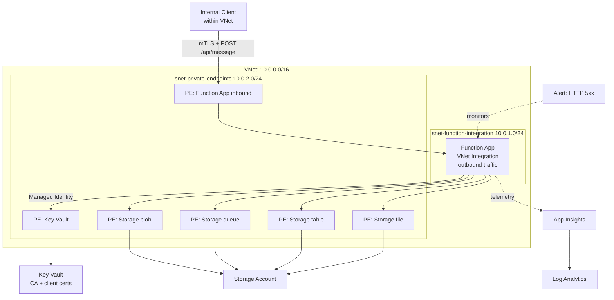

# azure-lz - Internal API Landing Zone

This project deploys a fully internal API in Azure. It’s only reachable from within the VNet, uses mTLS for client authentication, and all infrastructure is managed with Terraform.

I used a Function App with a Private Endpoint instead of APIM, mainly for simplicity and lower cost for a single internal API so I could focus on networking, certificates, and observability.

## Architecture



### How Traffic Flows

1. An internal client (another service in the VNet) calls `POST /api/message` via the Function App's private endpoint
2. The client must present a TLS client certificate signed by the CA -> No cert means the request is rejected before the code runs
3. The Function App processes the request and returns `message` + `timestamp` + `requestId`
4. The Function App reaches Key Vault (to read the CA cert) via private endpoint through VNet integration
5. The Function App reaches Storage via private endpoints for blob, queue, table, and file
6. All flows to Application Insights to Log Analytics
7. The alert rule fires if 5+ HTTP 5xx errors occur in 5 minutes

## Repo Structure

```
azure-lz/
├── modules/
│   ├── networking/            # VNet, subnets, NSGs, private DNS zones
│   │   ├── main.tf
│   │   ├── variables.tf
│   │   └── outputs.tf
│   ├── key_vault_certs/       # Key Vault + self-signed CA + client cert + PE
│   │   ├── main.tf
│   │   ├── variables.tf
│   │   └── outputs.tf
│   ├── function_app/          # Function App, storage, VNet integration, PE, mTLS
│   │   ├── main.tf
│   │   ├── variables.tf
│   │   └── outputs.tf
│   └── observability/         # Log Analytics, App Insights, action group
│       ├── main.tf
│       ├── variables.tf
│       └── outputs.tf
├── environments/
│   └── dev/                   # All 4 modules together
│       ├── main.tf
│       ├── providers.tf
│       ├── versions.tf
│       ├── locals.tf
│       ├── variables.tf
│       ├── outputs.tf
│       └── terraform.tfvars.example
├── src/
│   └── function_app/          # Python function code
│       ├── function_app.py
│       ├── host.json
│       └── requirements.txt
└── .github/
    └── workflows/
        └── terraform.yml      # CI/CD: fmt, validate, plan (OIDC auth)
```

## Assumptions

- Only one workload, so only one delegated subnet for Function outbound traffic.
- Two subnets are enough here (integration + private endpoints).
- Deployment lives in a single region (UK South).
- Self‑signed certs are fine for the scenario.
- Consumption plan (Y1) keeps dev costs close to zero.
- No hub/spoke: this is a standalone spoke VNet.
- No custom domain; Azure default hostname is fine for this exercise.
- Relying on Azure’s implicit deny for NSGs.
- Function code deployment is a separate manual action.
- Key Vault uses RBAC instead of access policies.
- Storage needs four private endpoints (blob, queue, table, file).
- mTLS checks only that a cert exists, not the CA chain.
- App Insights uses connection strings rather than instrumentation keys.
- Local Terraform state for the assessment; production would use remote state.
- Alerts live in the environment folder to avoid module dependency loops.

## Design Decisions
- Decision - Reason - Alternative

- Function + Private Endpoint - Simple and Cheap for one API - APIM Internal mode for mTLS termination + policies
- 4 Modules - Clear Seperation, reusable - Dedicated modules for RBAC, Alerts
- Consumption Plan - Zero cost for dev - Premium Plan (EP1) for prd
- Self-signed certs - Scenario mentioned - Enterprise PKI 
- DNS inside networking module - Centralised - DNS resolver in a hub/spoke split
- Key Vault RBAC - Microsoft Recommended
- PEM for certs - Cleaner than PFX
- No purge protection - Easier destruction - Full Retention plan + Purge Protection 
- Alert in environments - Time - Dedicated alert module. 
 
## CI/CD

### GitHub Actions Workflow

Terraform CI runs on PRs and pushes:

terraform fmt -check
terraform validate
terraform plan

### OIDC Authentication Setup

The pipeline uses OpenID Connect (OIDC) instead of storing Azure credentials as GitHub secrets. OIDC is more secure because:

- No long-lived secrets to rotate or leak
- GitHub requests a short-lived token from Azure AD for each run
- The token expires after the job finishes


**To configure OIDC:**

1. **Create an App Registration in Azure AD:**
   ```bash
   az ad app create --display-name "github-actions-terraform"
   ```
   Or Manually via Portal

2. **Create a Service Principal:**
   ```bash
   az ad sp create --id <app-id>
   ```
   Or Manually via Portal

3. **Add a Federated Credential** (links GitHub to Azure AD):
   ```bash
   az ad app federated-credential create --id <app-id> --parameters '{
     "name": "github-main",
     "issuer": "https://token.actions.githubusercontent.com",
     "subject": "repo:<your-org>/<your-repo>:ref:refs/heads/main",
     "audiences": ["api://AzureADTokenExchange"]
   }'
   ```
4. **Grant the SP permissions on your subscription:**
   ```bash
   az role assignment create \
     --assignee <app-id> \
     --role "Contributor" \
     --scope /subscriptions/<subscription-id>

   az role assignment create \
     --assignee <app-id> \
     --role "User Access Administrator" \
     --scope /subscriptions/<subscription-id>
   ```

5. **Add three secrets in GitHub** (Settings → Secrets → Actions):
   - `AZURE_CLIENT_ID` - the App Registration's Application (client) ID
   - `AZURE_TENANT_ID` - your Azure AD tenant ID
   - `AZURE_SUBSCRIPTION_ID` - your Azure subscription ID

> **Note:** No client secret is stored anywhere. The `User Access Administrator` role is needed because we create RBAC assignments (Function MI → Key Vault).

## Setup Instructions

### Prerequisites

- Terraform >= 1.5.0
- Azure CLI (`az login`)
- An Azure subscription with Contributor + User Access Administrator
- Python 3.11 (for local function testing)

### Deploy

```bash
cd environments/dev
cp terraform.tfvars.example terraform.tfvars # edit with own values
terraform init
terraform plan
terraform apply
```

### Deploy the Function Code

```bash
cd src/function_app
func azure functionapp publish <function-app-name> --python
```

### Testing mTLS

```bash
# From a VM or resource INSIDE the VNet:
curl -X POST https://<function-hostname>/api/message \
  --cert client.pem \
  --key client-key.pem \
  -H "Content-Type: application/json" \
  -d '{"message": "hello from internal service"}'

# Expected:
# {"message": "hello from internal service", "timestamp": "...", "requestId": "..."}

# Without a client cert - rejected at the TLS layer, never reaches our code
```

> **Note:** Since public access is disabled on the Function App, testing requires a resource inside the VNet (e.g. an Azure VM or Bastion). You can verify the deployment is correct using Azure CLI without needing VNet access - see Teardown section.

## Teardown

```bash
cd environments/dev
terraform destroy
```
Key Vault soft-delete may require  
```bash
az keyvault purge --name kv-internalapidev01
```

## Cost Estimate

All costs are covered by the Azure free trial $200/£150 credit. At ~£9-10/month, this uses less than 7% of the free credit even if left running for the full 30 days.

| Resource | Estimated Monthly Cost (dev) |
|---|---|
| Function App (Consumption Y1) | ~£0 (first 1M executions free) |
| Storage Account (LRS) | ~£0.01-0.02 |
| Key Vault (standard) | ~£0.02 per 10K operations |
| Log Analytics (30 day retention) | Free (first 5GB/month included) |
| Application Insights | Free (uses Log Analytics ingestion) |
| Private Endpoints (6x) | ~£6 (£1/month each) |
| Private DNS Zones (6x) | ~£3 (£0.50/month each) |
| **Total** | **~£9-10/month** |

## AI Usage & Critique

| Step | What I used AI for | What it suggested | What I changed and why |

| Private DNS zones | Private endpoint DNS setup | Only included blob for storage - missed queue, table, and file | Added all four - the Function runtime needs all of them |
| Key Vault | Key Vault setup with certs | Suggested access policies instead of RBAC mode | Changed to RBAC as its more granular, works properly with managed identities |
| Observability | Log Analytics + App Insights + alert | Put the alert rule in the observability module, creating a circular dependency | Moved the alert rule to the environment config to break the circular dependency |
| Observability | App Insights instrumentation key | Included it as a primary output | Marked it as legacy - Microsoft recommends using the connection string instead |
| CI/CD | GitHub Actions workflow | Generated a base template for Terraform CI and suggested storing Azure credentials as GitHub secrets | Edited the template to use OIDC instead — no long-lived secrets, short-lived tokens per run, more secure. Added format check and validate steps |

### Patterns I Corrected
- **Circular dependency:** AI put the alert rule (which targets the Function App) in the observability module, but the Function App needs App Insights from observability. Moved the alert rule to the environment config.
- **Storage PE oversimplification:** Treated storage access as a single blob PE. Function Apps need blob, queue, table, and file — each requires its own PE and DNS zone.
- **Default to access policies:** Key Vault access policies are legacy. RBAC is the modern approach.
