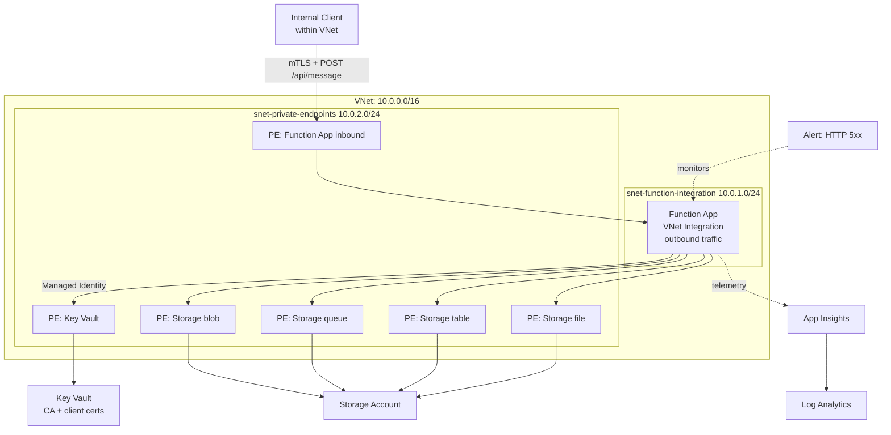

# azure-lz - Internal API Landing Zone

This project deploys a fully internal API in Azure. It’s only reachable from within the VNet, uses mTLS for client authentication, and all infrastructure is managed with Terraform.

I used a Function App with a Private Endpoint instead of APIM, mainly for simplicity and lower cost for a single internal API so I could focus on networking, certificates, and observability.

## Architecture



### How Traffic Flows

1. An internal client (another service in the VNet) calls `POST /api/message` via the Function App's private endpoint
2. The client must present a TLS client certificate signed by the CA -> No cert means the request is rejected before the code runs
3. The Function App processes the request and returns `message` + `timestamp` + `requestId`
4. The Function App reaches Key Vault (to read the CA cert) via private endpoint through VNet integration
5. The Function App reaches Storage via private endpoints for blob, queue, table, and file
6. All flows to Application Insights to Log Analytics
7. The alert rule fires if 5+ HTTP 5xx errors occur in 5 minutes

## Repo Structure

```
azure-lz/
├── modules/
│   ├── networking/            # VNet, subnets, NSGs, private DNS zones
│   │   ├── main.tf
│   │   ├── variables.tf
│   │   └── outputs.tf
│   ├── key_vault_certs/       # Key Vault + self-signed CA + client cert + PE
│   │   ├── main.tf
│   │   ├── variables.tf
│   │   └── outputs.tf
│   ├── function_app/          # Function App, storage, VNet integration, PE, mTLS
│   │   ├── main.tf
│   │   ├── variables.tf
│   │   └── outputs.tf
│   └── observability/         # Log Analytics, App Insights, action group
│       ├── main.tf
│       ├── variables.tf
│       └── outputs.tf
├── environments/
│   └── dev/                   # All 4 modules together
│       ├── main.tf
│       ├── providers.tf
│       ├── versions.tf
│       ├── locals.tf
│       ├── variables.tf
│       ├── outputs.tf
│       └── terraform.tfvars.example
├── src/
│   └── function_app/          # Python function code
│       ├── function_app.py
│       ├── host.json
│       └── requirements.txt
└── .github/
    └── workflows/
        └── terraform.yml      # CI/CD: fmt, validate, plan (OIDC auth)
```

## Assumptions

- Only one workload, so only one delegated subnet for Function outbound traffic.
- Two subnets are enough here (integration + private endpoints).
- Deployment lives in a single region (UK South).
- Self‑signed certs are fine for the scenario.
- Consumption plan (Y1) keeps dev costs close to zero.
- No hub/spoke: this is a standalone spoke VNet.
- No custom domain; Azure default hostname is fine for this exercise.
- Relying on Azure’s implicit deny for NSGs.
- Function code deployment is a separate manual action.
- Key Vault uses RBAC instead of access policies.
- Storage needs four private endpoints (blob, queue, table, file).
- mTLS checks only that a cert exists, not the CA chain.
- App Insights uses connection strings rather than instrumentation keys.
- Local Terraform state for the assessment; production would use remote state.
- Alerts live in the environment folder to avoid module dependency loops.

## Design Decisions
- Decision - Reason - Alternative

- Function + Private Endpoint - Simple and Cheap for one API - APIM Internal mode for mTLS termination + policies
- 4 Modules - Clear Seperation, reusable - Dedicated modules for RBAC, Alerts
- Consumption Plan - Zero cost for dev - Premium Plan (EP1) for prd
- Self-signed certs - Scenario mentioned - Enterprise PKI 
- DNS inside networking module - Centralised - DNS resolver in a hub/spoke split
- Key Vault RBAC - Microsoft Recommended
- PEM for certs - Cleaner than PFX
- No purge protection - Easier destruction - Full Retention plan + Purge Protection 
- Alert in environments - Time - Dedicated alert module. 
 
## CI/CD

### GitHub Actions Workflow

Terraform CI runs on PRs and pushes:

terraform fmt -check
terraform validate
terraform plan

### OIDC Authentication Setup

The pipeline uses OpenID Connect (OIDC) instead of storing Azure credentials as GitHub secrets. OIDC is more secure because:

- No long-lived secrets to rotate or leak
- GitHub requests a short-lived token from Azure AD for each run
- The token expires after the job finishes

