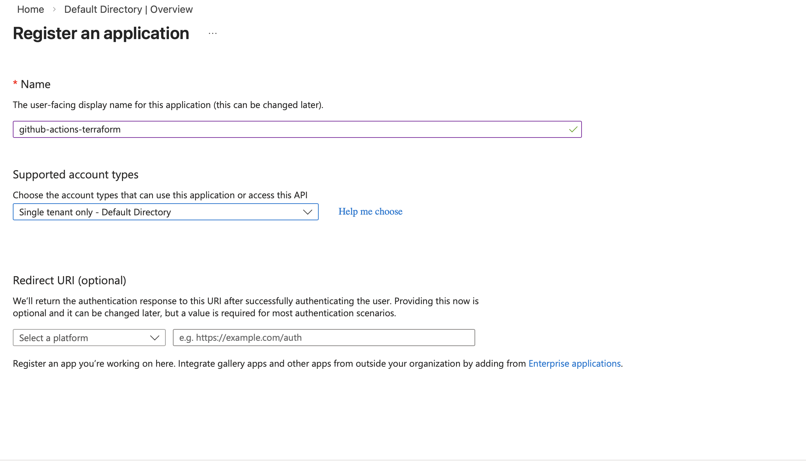
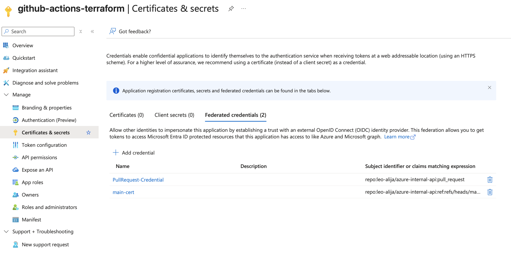
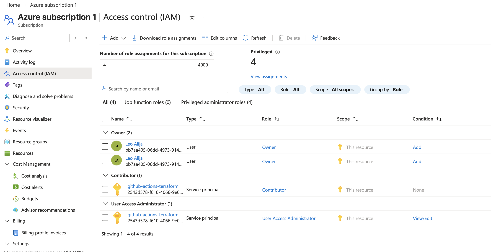
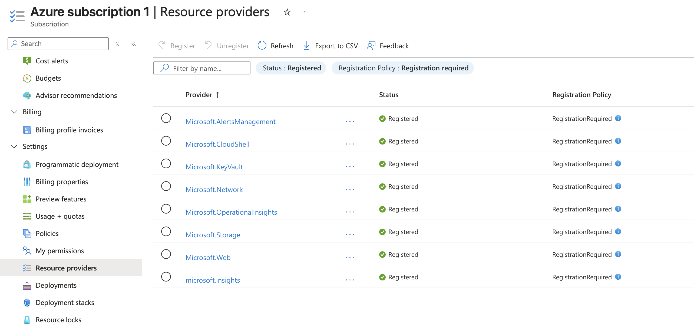

# Azure OIDC Setup — Manual Configuration Guide

This document captures all the manual steps performed in Azure Portal + GitHub needed for OpenID Connect (OIDC) authentication used by GitHub Actions.

## Step 1 : Create Azure AD App Registration

Microsoft Entra ID  
App registrations  
New registration

Name: github-actions-terraform

**Take note of:**
- Application (client) ID
- Directory (tenant) ID

## Step 2 : Add Federated Credentials

### Branch-Based Deploys (main)
Scenario: GitHub Actions deploying Azure resources  
Organization: your GitHub username  
Repository: azure-lz  
Entity type: Branch  
Branch: main

### Pull Request Validation
Scenario: GitHub Actions deploying Azure resources  
Organization: your GitHub username  
Repository: azure-lz  
Entity type: Pull request

## Step 3 : Assign RBAC Roles

- Contributor  
- User Access Administrator

## Step 4 : Add GitHub Secrets

- AZURE_CLIENT_ID (App registration → Application ID)
- AZURE_TENANT_ID
- AZURE_SUBSCRIPTION_ID